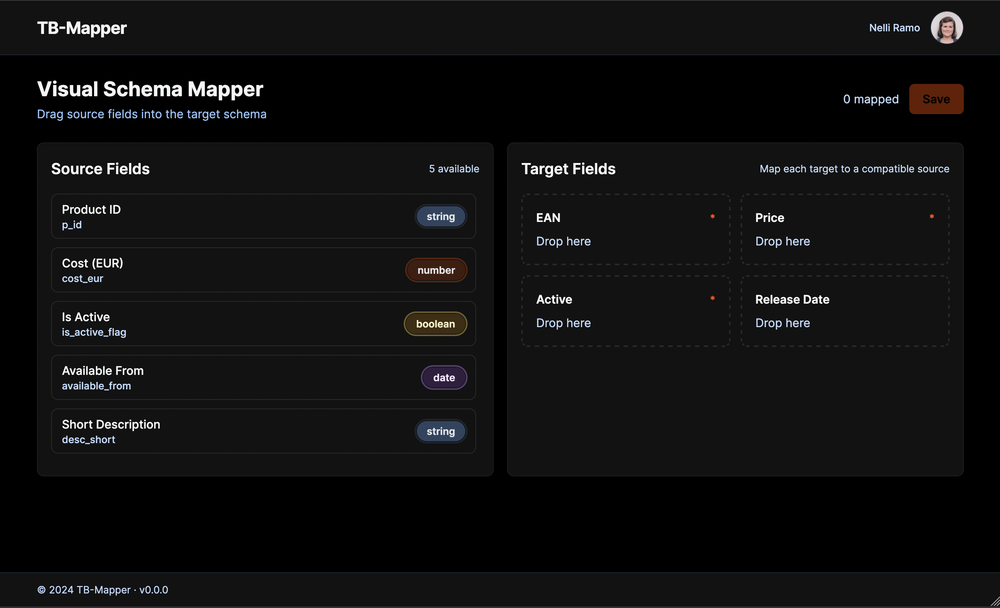

# TB-Mapper: Visual Data Integration Tool


**Pitch:** A resilient schema-mapping middleware that enables type-safe data transformation between disparate B2B systems.
---



## The Business Why
Fashion brands keep their product data in proprietary formats, while marketplaces like Zalando require strict schemas. TB-Mapper reduces onboarding friction by letting account managers visually connect brand fields to marketplace fields and by validating types immediately. This prevents ingestion errors before they reach downstream APIs, keeping catalogs live and revenue flowing.

## Architectural Decisions
- **TanStack React Query for server state:** Schema definitions and saved mappings are treated as remote data that benefit from caching, background refetching, and optimistic updates. This keeps the UI responsive even when network conditions vary.
- **Zustand for client state:** Drag-and-drop editing is transient session state. Keeping it in a lightweight store avoids unnecessary re-renders and keeps concerns separate from server data until the user clicks **Save**.
- **@dnd-kit for drag-and-drop:** Chosen over `react-beautiful-dnd` for its headless primitives, accessibility focus, and robust multi-container support—critical for mapping fields across multiple schemas.

## Trade-offs & Known Limitations
- **Client-side validation first:** Validation runs in the browser for instant feedback. A production setup should repeat validation server-side to guard against malicious or out-of-date clients.
- **Virtualization required for scale:** Source fields now render through `@tanstack/react-virtual` so scroll performance stays smooth for CSVs with thousands of rows. The `estimateSize` is tuned to card height and can be adjusted per design.

## Observability & Error Handling
- **Typed telemetry service:** A singleton `Analytics` service in `src/services/analytics.ts` strictly types mapping events (`MAPPING_SUCCESS`, `VALIDATION_ERROR`, `APP_CRASH`), records an error-rate KPI (failed vs. successful mappings), and logs each event via `console.group` for easy filtering in the browser console.
- **Global error boundary:** The entire app is wrapped in `react-error-boundary` with a friendly fallback UI and crash telemetry hook so unexpected render errors are captured as critical KPIs.
- **Actionable user feedback:** Validation errors produce a toast (`react-hot-toast`) so users immediately know when a drag-and-drop attempt fails compatibility rules.

## Project Structure
The project source lives in `visual-schema-mapper/` and follows a feature-first layout under `src/`, grouping UI, state, and utilities by domain. This improves discoverability and keeps related logic together as the mapping surface grows.

```
visual-schema-mapper/
  src/
    features/            # Domain-specific UI, hooks, and services
    components/          # Reusable UI building blocks
    lib/                 # Shared utilities (e.g., fetch wrappers)
    styles/              # Tailwind entry points and design tokens
```

## TypeScript & build rigor
- **Strict-by-default:** `tsconfig.app.json` enables `strict`, `noImplicitAny`, `strictNullChecks`, and `noUncheckedIndexedAccess` so every index lookup is treated as potentially `undefined`—catching edge cases early instead of debugging them in production builds.
- **Aligned bundling:** `moduleResolution` is set to `bundler` to match Vite’s pipeline and avoid resolution surprises between editor and build output.
- **Ergonomic imports:** The `@/*` alias targets `src/*` in both TypeScript and Vite, letting contributors import components like `@/features/mapper/components/MappingCanvas` without deep relative paths.

## How to Run
1. Use the pinned Node version:
   ```bash
   cd visual-schema-mapper
   nvm use
   ```
   The `.nvmrc` file locks the project to Node 20.18.0 so local installs match the CI/CD and release workflows.
2. Install dependencies:
   ```bash
   npm install
   ```
3. Start the development server:
   ```bash
   npm run dev
   ```
4. Open the printed local URL in your browser to interact with the mapper.

## React Query usage (demo-friendly)
- **Why React Query:** Remote schema + profile calls are cached so drag-and-drop state (`zustand`) stays decoupled from server state. Query keys (`['schema-fields']`, `['user-profile']`) isolate cache entries for predictable invalidation.
- **Open API example:** `useUser` fetches a deterministic persona from `https://randomuser.me/api/?seed=tradebyte`. The stable `seed` parameter mimics an auth token without shipping secrets, so contributors can run the demo without credentials.
- **Static auth token pattern:** For APIs that expect a bearer token, wire it through `queryFn` headers (e.g., `Authorization: DemoToken`) and keep it in `.env.local`. The `useSchema` hook shows the same pattern with mocked data and a short artificial delay to demonstrate loading states.

## GitHub Pages base path
Vite's `base` is set to `/react-visual-schema-mapper/` so static assets load correctly when deployed to GitHub Pages. If the repository name changes, update `vite.config.ts` to match the new repo name.

## Release Automation
Install the release tooling inside `visual-schema-mapper/`:

```bash
npm install --save-dev semantic-release @semantic-release/git
```

## Testing strategy
- **Unit & integration (Vitest):** Core business rules are covered in `src/features/mapper/utils/validators.test.ts` (Tradebyte type compatibility), store behaviors in `src/features/mapper/store/mapperStore.test.ts`, UI states in `src/features/mapper/components/DraggableField.test.tsx`, and profile/loading behavior in `src/components/layout/UserProfile.test.tsx` and `src/hooks/useUser.test.tsx`.
- **End-to-end (Playwright):** `tests/e2e/mapper.spec.ts` simulates the drag-and-drop happy path and the Tradebyte validation rule, using `tests/e2e/utils/dragHelper.ts` for reliable pointer events and `tests/e2e/global-setup.ts` to strip stray Jest matchers.

### Running tests locally
From the `visual-schema-mapper/` directory:

1. Install dependencies: `npm install`
2. Run unit/integration tests: `npm test`
3. Run the linter: `npm run lint`
4. Run Playwright end-to-end tests (starts Vite automatically on port 4173 by default): `npx playwright test`

When developing e2e tests, you can override the server port or base URL via `PLAYWRIGHT_PORT` and `PLAYWRIGHT_BASE_URL` environment variables; see `playwright.config.ts` for defaults.

## CI/CD pipeline
The GitHub Actions workflow `.github/workflows/ci-cd.yml` executes the same steps on every push and pull request to `main`:

1. Install dependencies via `npm ci`.
2. Run ESLint and Vitest.
3. Install Playwright browsers and execute the e2e suite.
4. On `main` pushes, run Semantic Release to publish a new version.
5. If release succeeds, build the app and deploy the `dist/` bundle to GitHub Pages.
